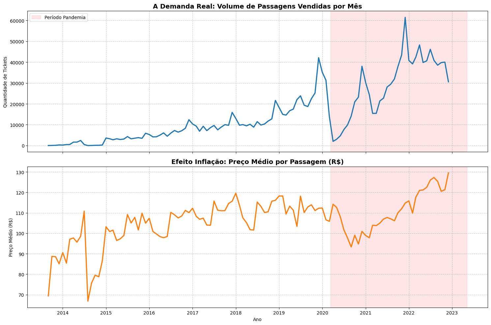
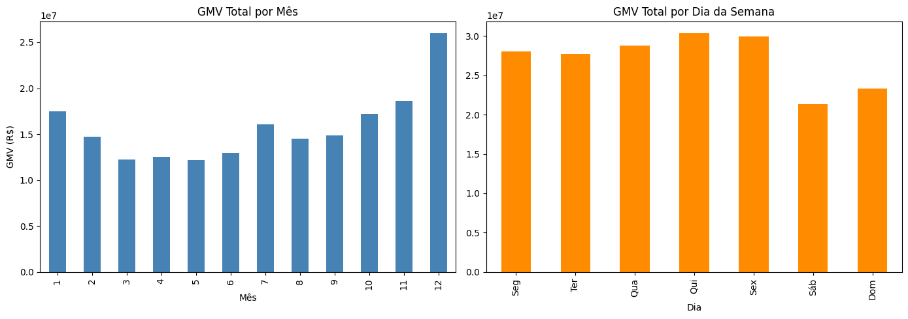
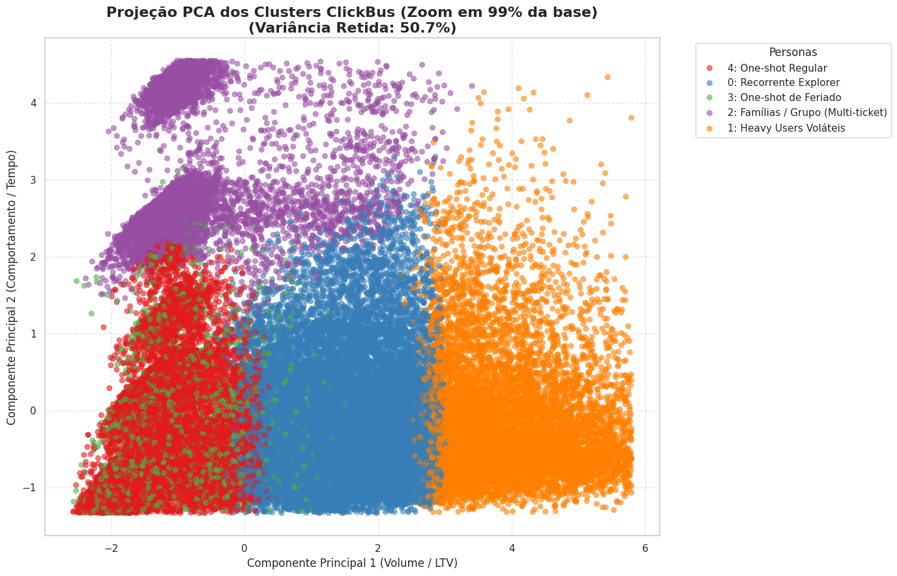
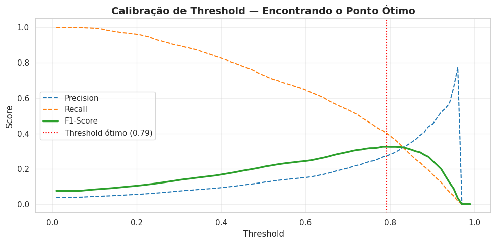
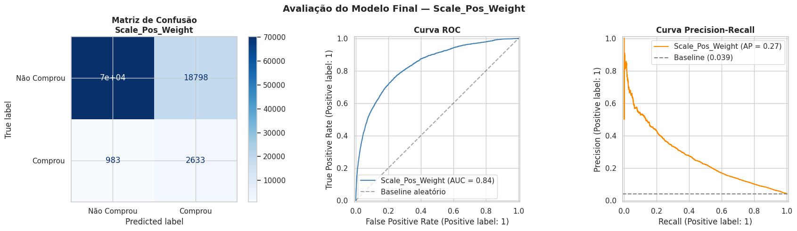

# ClickBus — Decodificando o Comportamento do Viajante

**FIAP Innovation Challenge 2025 · Refatoração v2 · Portfólio de Data Science**

---

## Contexto

A ClickBus lidera o mercado de passagens rodoviárias no Brasil, operando em um setor de 170 milhões de tickets/ano e R$ 20 bilhões em GMV, ainda majoritariamente offline. Este projeto usa dados reais anonimizados do Innovation Challenge FIAP 2025 para mapear o comportamento de compra dos usuários e construir modelos preditivos que suportem estratégias de Growth.

**Pipeline completo:** Arquitetura Medalhão + EDA robusta + Segmentação de clientes + Propensão de recompra (30 dias) + Previsão de próximo trecho.

---

## v1 vs. v2 — Por que a refatoração existe

A solução original foi entregue no **1º ano da graduação** como resposta direta ao Innovation Challenge. O código funcionava, mas concentrava toda a lógica em um único notebook, sem separação de camadas e com data leakage na construção de features — variáveis como popularidade de trechos e sazonalidade eram calculadas sobre o dataset completo antes do split temporal, contaminando o treino com informação do futuro.

A **refatoração v2**, desenvolvida no **2º ano**, reconstrói o mesmo projeto com critérios mais rigorosos:

- **Arquitetura Medalhão:** Bronze (ingestão), Prata (limpeza), Ouro (EDA e modelos).
- **Código modular:** funções de regra de negócio centralizadas em `src/utils.py`.
- **Prevenção de leakage por design:** toda estatística calculada exclusivamente sobre `df_treino` e replicada em validação/teste via `.map()`.

O notebook original (`Data_Trip_Modelo_final_ClickBus.ipynb`) está mantido no repositório como linha de base histórica, evidenciando a evolução entre as duas versões.

---

## Diferenciais analíticos

**Economia aplicada a dados**

A formação em Economia orienta decisões que a técnica sozinha não entrega. O período COVID é tratado como choque exógeno estrutural — não como ruído a ser removido, mas como variável que altera permanentemente os parâmetros do modelo. O `score_fidelidade` é calculado como a proporção do GMV do cliente concentrada em uma única operadora, análogo ao conceito de market share individual. O threshold do modelo binário é calibrado pela relação entre custo de campanha e ticket médio esperado, tornando a decisão de corte uma decisão de negócio.

**Framework RFM estendido**

Além das métricas clássicas de Recência, Frequência e Valor, o `df_cliente` inclui variáveis de comportamento sazonal (`prop_feriado`, `prop_fim_semana`, `prop_ida_volta`), diversidade de destinos e features de ritmo de compra (`intervalo_medio_dias`, `sazonalidade_score`).

**Rigor estatístico na EDA**

Transformação `log1p` para tratar assimetria severa em variáveis financeiras, análise de correlação Pearson e Spearman, e diagnóstico de multicolinearidade via VIF — com remoção de variáveis redundantes justificada por par.

---

## Estrutura do Repositório

```
Challenge_ClickBus_FIAP_2025/
│
├── src/
│   └── utils.py                                         # Funções modulares compartilhadas
│
├── notebooks/
│   ├── Data_Trip_ClickBus_Camada_Bronze.ipynb           # Ingestão e integridade
│   ├── Data_Trip_ClickBus_Camada_Prata.ipynb            # Limpeza, features e split temporal
│   ├── Data_Trip_ClickBus_Camada_Ouro_EDA.ipynb         # EDA + df_cliente
│   ├── Data_Trip_ClickBus_Camada_Ouro_Segmentação.ipynb # K-Means (5 clusters)
│   ├── Data_Trip_ClickBus_Camada_Ouro_Timing_é_tudo.ipynb # XGBoost (recompra 30d)
│   ├── Data_Trip_ClickBus_Camada_Ouro_Próximo_Trecho.ipynb # LightGBM (próximo trecho)
│   └── Data_Trip_Modelo_final_ClickBus.ipynb            # [V1 ORIGINAL — referência histórica]
│
├── imagens/
│   ├── demanda_real_x_inflacao.png
│   ├── gmv_dia_e_mes.png
│   ├── projecao_pca_clusterizao.png
│   ├── calibracao_threshold.png
│   └── avaliacao_modelo_final_weight.png
│
└── README.md
```

---

## Notebooks — Pipeline Medalhão

**Bronze — Ingestão e integridade**
Lê o CSV bruto (~1,7M linhas, 2013–2024), valida schema, nulos e intervalo de datas. Salva `clickbus_bronze.parquet` como fonte imutável do projeto.

**Prata — Limpeza e preparação**
Decodifica hashes anonimizados de cidades, empresas e clientes. Remove registros inconsistentes (GMV negativo, origem igual ao destino, dados de ida ausentes) com log estruturado de impacto por regra. Cria features determinísticas (`e_feriado`, `compra_ate_5_dias_feriado`, `trecho_ida`, `empresa_ida`) antes do split — seguro porque não dependem de estatísticas do treino. Realiza split temporal out-of-time sem embaralhamento.

**Ouro — EDA e Feature Engineering**
Análise exploratória restrita a `df_treino`. Cobre sazonalidade de GMV, concentração de rotas (Pareto 80/20), série histórica com quebra estrutural COVID marcada e market share de operadoras. Constrói `df_cliente` com RFM estendido, aplica VIF e correlação Spearman para eliminar redundâncias, e transforma variáveis assimétricas com `log1p`.

O gráfico abaixo mostra a evolução do faturamento mensal com destaque para o choque exógeno da pandemia — tratado como quebra estrutural, não como ruído:



Sazonalidade por mês e por dia da semana — base para as features de comportamento temporal do `df_cliente`:



**Segmentação — K-Means (k = 5)**
K escolhido por Elbow, Silhouette Score e interpretabilidade das personas. Visualizações incluem PCA 2D, radar chart do DNA econômico por cluster e análise de estabilidade por período COVID.

**Timing é Tudo — XGBoost (propensão de recompra a 30 dias)**
Target construído a partir de `df_val` filtrado aos primeiros 30 dias após o corte — sem esse filtro a taxa de positivos inflaria de ~4% para ~40%. Compara três estratégias de balanceamento via `ImbPipeline` com sampler dentro do CV (SMOTE dentro do fold, sem leakage). Threshold calibrado por máximo F1 na curva Precision-Recall. Interpretação via SHAP.

**Próximo Trecho — LightGBM (classificação multiclasse)**
Prevê o próximo par origem-destino de clientes recorrentes. `ultimo_trecho` (último destino no treino) é a feature preditiva central. Foco nos top-10 trechos por frequência. `class_weight='balanced'` para desbalanceamento multiclasse nativo do LightGBM.

---

## Resultados

### Segmentação — 5 personas de Growth

| Cluster | Nome | Características | Estratégia |
|--------:|---|---|---|
| 0 | Recorrente Explorer | Frequência e valor acima da média, muitos destinos | Cross-sell de rotas, recomendação personalizada |
| 1 | Heavy User Volátil | Maior GMV da base, baixa fidelidade a empresa | Programa de fidelidade, captura de share of wallet |
| 2 | Famílias / Grupo | Ticket alto, forte ida-volta, multi-tickets | Combos e descontos progressivos por volume |
| 3 | One-shot de Feriado | Compra única concentrada em feriados | Campanha sazonal 30–45 dias antes de feriados |
| 4 | One-shot Regular | Compra única fora de feriado | Reativação — incentivo à segunda viagem |

Projeção PCA dos 5 clusters sobre 99% da base — os grupos apresentam separação clara no espaço de Volume/LTV vs. Comportamento/Tempo:



### Propensão de Recompra (XGBoost)

Com ratio de desbalanceamento de 24,6:1, o baseline aleatório teria AUC-PR de ~0,04. A estratégia vencedora (`scale_pos_weight`) calibrada ao threshold de 79% atingiu precisão de 27,34% — quase 6x a taxa natural de conversão da base. Os principais drivers identificados pelo SHAP foram recência e ritmo de compra (`intervalo_medio_dias`), alinhados com a teoria de Customer Lifetime Value.

Calibração do threshold por máximo F1 — o ponto ótimo em 0,79 equilibra precisão e recall para o custo de campanha esperado:



Avaliação final do modelo: Matriz de Confusão, Curva ROC (AUC = 0,84) e Curva Precision-Recall (AP = 0,27 vs. baseline 0,039):



### Próximo Trecho (LightGBM)

| Métrica | Modelo | Baseline aleatório | Ganho |
|---|---|---|---|
| Top-1 Accuracy | 39,7% | 10,0% | 4,0x |
| Top-3 Accuracy | 73,8% | 30,0% | 2,5x |

Um carrossel de 3 destinos sugeridos acerta o destino real em 73,8% dos casos — resultado diretamente acionável em uma interface de recomendação.

---

## Limitações e Aprendizados

Documentar limitações não é fraqueza — é o que distingue análise honesta de análise conveniente.

**A maldição da cardinalidade no Modelo 3.** O dataset original tem quase 30.000 pares únicos de origem-destino. Tratar isso como classificação multiclasse pura satura a função de perda e limita a generalização. O problema seria melhor abordado como um sistema de recomendação (Learning to Rank) ou com clusterização geográfica prévia das rotas antes do algoritmo preditivo. O foco nos top-10 trechos foi uma decisão pragmática para viabilizar o portfólio dentro do escopo, não a solução ideal.

**O desbalanceamento do Modelo 2 é genuíno.** Taxa de 4% de positivos em recompra a 30 dias é o número real do setor — não um problema de amostragem. O AUC-PR de ~0,15 parece baixo em termos absolutos, mas representa 3,75x o acaso num problema difícil. Métricas sem contexto de baseline enganam.

**Split estratificado dentro do modelo vs. split temporal da Prata.** O split `train_test_split` dentro dos notebooks de modelagem é estratificado (correto para o nível de cliente agregado). Numa versão produtiva, o ideal seria consumir diretamente os blocos gerados na Prata e avaliar sobre `df_teste` mantido intacto desde o início.

---

## Como Executar

Os notebooks rodam no Google Colab com dados no Google Drive. Execute estritamente na ordem abaixo — cada etapa lê os Parquets gerados pela anterior.

```
Bronze → Prata → Ouro_EDA → Segmentacao → Timing_e_Tudo → Proximo_Trecho
```

Estrutura esperada no Drive:
```
Portifólio DS Vini/Challenge_ClickBus_2025/data/
├── bronze/   → clickbus_bronze.parquet
├── prata/    → clickbus_treino · clickbus_val · clickbus_teste
└── ouro/     → df_cliente · df_cluster · df_cliente_clusterizado
               → xgboost_30d.pkl · df_modelo_classificacao
               → lightgbm_proximo_trecho.pkl · df_predicoes_proximo_trecho
```

---

## Tecnologias

`pandas` · `numpy` · `scikit-learn` · `xgboost` · `lightgbm` · `imbalanced-learn` · `shap` · `matplotlib` · `seaborn` · `statsmodels` · `scipy` · `holidays` · `pyarrow`

---

## Autor

**Vinicius de Sousa Macedo**
Quality Analyst | CX & tNPS — Nubank
Tecnólogo em Data Science (FIAP) · Bacharel em Ciências Econômicas (ESEG)

- LinkedIn: https://linkedin.com/in/vsmacedo-datafinance
- GitHub: https://github.com/vsmacedo-datafinance

---

*Dados fornecidos pela ClickBus para fins acadêmicos e de portfólio profissional, anonimizados conforme a LGPD.*
